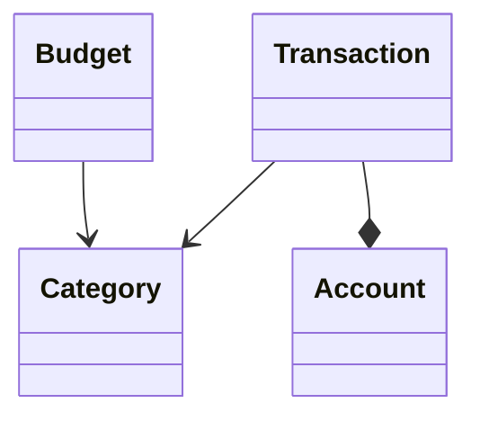
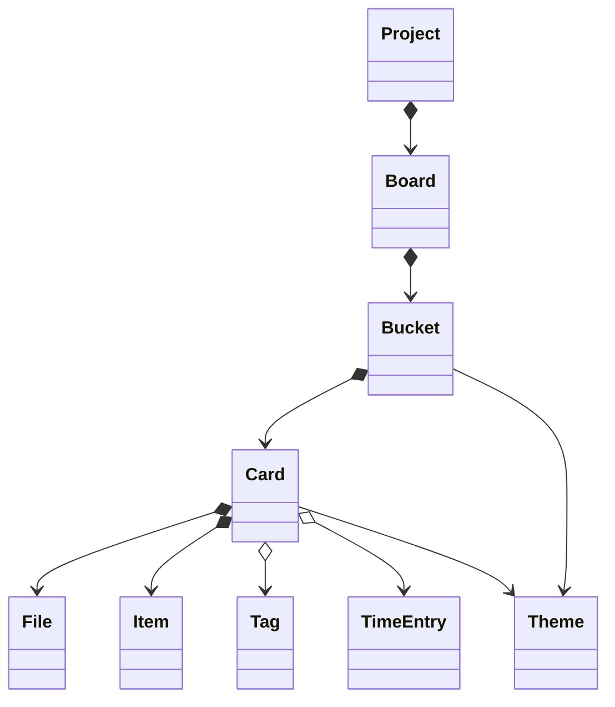
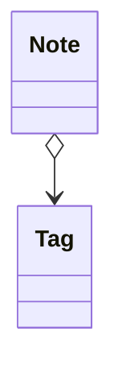
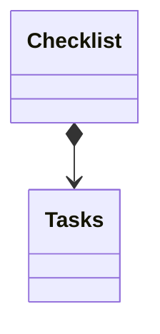
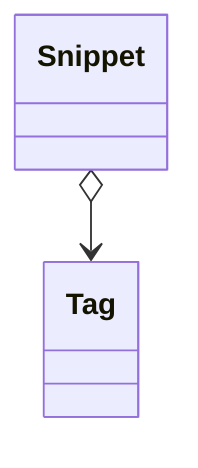
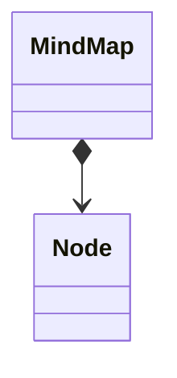
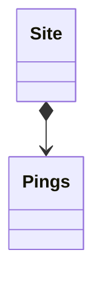

# Project Mono

## Inspiration

This project began as a playground for me to learn Python. 
It consists of a big Django project composed of a set of apps.  

## Stack

Main Python libs:
- Django
- Django REST Framework
- Pipenv
- Pytest
- Pylint
- Black

Other tools:
- SQLite for development database
- Fomantic-UI for frontend styling

## Main apps

### Finance

App to organize personal financial life by storing expenses and displaying charts.

#### Main models

### Project Manager

App to manage projects using a kanban-style layout.

#### Main models

### Notes

App to write notes using markdown syntax.

#### Main models

### Checklists

Simple to-do app.

#### Main models

### Coder

Store snippets of code.

#### Main models

### Mind Maps

#### Main models

### Pixel

#### Main models

